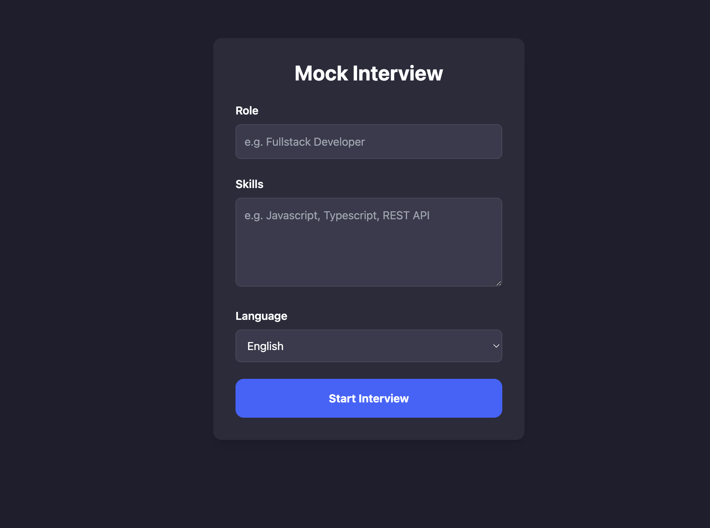

# Interview Application

This is a desktop port of a mock interview application.




## Installation

To run this application, you'll need to have Wails installed on your system. Wails is a framework for building desktop applications using Go and web technologies.

### Installing Wails

1. Make sure you have Go installed on your system (version 1.16 or later).
2. Open a terminal and run the following command to install Wails:

   ```
   go install github.com/wailsapp/wails/v2/cmd/wails@latest
   ```

3. Verify the installation by running:

   ```
   wails version
   ```

### Running the Application

1. Clone this repository to your local machine.
2. Navigate to the project directory in your terminal.
3. Run the following command to start the application in development mode:

   ```
   wails dev
   ```

   This will compile and run the application, allowing you to make changes and see them in real-time.

4. To build a production version of the application, use:

   ```
   wails build
   ```

   This will create an executable in the `build/bin` directory.

## API Keys

This application uses two APIs:

- OpenAI for generating responses and speech synthesis
- ElevenLabs for text-to-speech synthesis fallback for non-English languages

OpenAI API key is required to use the application. You can get one [here](https://platform.openai.com/signup).

ElevenLabs API key is optional. You can get one [here](https://elevenlabs.io/signup). When ElevenLabs key is not provided, the application will use the WebSpeech API to generate speech.